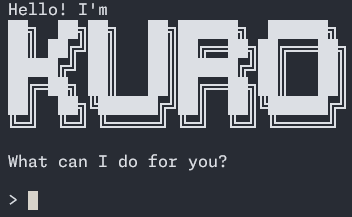

# Kuro user guide



Kuro is a command-line based chatbot that can manage your various tasks for you! Not only does it come with features
such as marking and unmarking various tasks as done, it also saves all your tasks and its data in a save file.

The save file is a CSV file, and is located at `./data/kuro.csv`. It is always updated after every command given, hence
you do not have to worry about loss of data.

## Adding tasks

There are 3 types of tasks that Kuro supports: todos, deadlines, and events. The table below shows the difference
between the 3 types of tasks in a nutshell:

| Task       | Name               | By    | From    | To    |
|------------|--------------------|-------|---------|-------|
| `todo`     | :white_check_mark: | -     | -       | -     |
| `deadline` | :white_check_mark: | `/by` | -       | -     |
| `event`    | :white_check_mark: | -     | `/from` | `/to` |

### Adding todos

Add a todo task to the list and save file:

```
todo {name}
```

`{name}` is the name of the todo to add.

After adding the todo task, it will be saved to the list and save file, with the following output:

```
> todo {name}
Got it. I've added this task:
  [T] [ ] {name}
Now you have 1 tasks in the list.
```

The `[T]` indicates this is a todo task item, while the `[ ]` indicates it is not done yet.

### Adding deadlines

Add a deadline task to the list and save file:

```
deadline {name} /by {by}
```

`{name}` is the name of the deadline to add, and `{by}` is when the deadline is up.

After adding the deadline task, it will be saved to the list and save file, with the following output:

```
> deadline {name} /by {by}
Got it. I've added this task:
  [D] [ ] {name} (by: {by})
Now you have 2 tasks in the list.
```

The `[D]` indicates this is a deadline task item, while the `[ ]` indicates it is not done yet.

### Adding events

Add an event task to the list and save file:

```
event {name} /from {from} /to {to}
```

`{name}` is the name of the event to add, `{from}` is when the event will be held from, and `{to}` is when the event
will last until.

After adding the event task, it will be saved to the list and save file, with the following output:

```
> event {name} /from {from} /to {to}
Got it. I've added this task:
  [E] [ ] {name} (from: {from}, to: {to})
Now you have 3 tasks in the list.
```

The `[E]` indicates this is an event task item, while the `[ ]` indicates it is not done yet.

## Listing tasks

To view your current tasks and its corresponding task IDs:

```
list
```

This will show the current list of tasks you have, along with its details, with the following output:

```
> list
Here are the tasks in your list:
1. [T] [ ] {name}
2. [D] [X] {name} (by: {by})
3. [E] [ ] {name} (from: {from}, to: {to})
```

For instance, the `2.` number at the beginning is the task ID, `[D]` indicates that the task is a deadline task item,
while the `[X]` indicates it is done.

## Marking task(s) as done

To mark a single or multiple tasks as done, you can append the task ID(s) to the `mark` command:

```
mark {id} [{id} ...]
```

`{id}` is the task ID of the task(s) to mark as done. Minimally, one valid task ID must be supplied.

```
> mark 1 3
Nice! I've marked this task as done:
1. [T] [X] {name}
3. [E] [X] {name} (from: {from}, to: {to})
```

## Marking task(s) as not done

To mark a single or multiple tasks as not done, you can append the task ID(s) to the `unmark` command:

```
unmark {id} [{id} ...]
```

`{id}` is the task ID of the task(s) to mark as not done. Minimally, one valid task ID must be supplied.

```
> unmark 1 3
OK, I've marked this task as not done yet:
1. [T] [ ] {name}
3. [E] [ ] {name} (from: {from}, to: {to})
```

## Deleting a task

To delete a task, use the task ID of the task:

```
delete {id}
```

`{id}` is the task ID of the task(s) to delete. Only one valid task ID can be supplied.

```
> delete 2
Noted. I've removed this task:
2. [D] [ ] {name} (by: {by})
Now you have 2 tasks in the list.
```

## Closing Kuro

To quit the program, simply run the `bye` command:

```
bye
```

Kuro will bid you goodbye, before quitting.

```
> bye
Bye. Hope to see you again soon!
```

## Advanced: Editing the save file

The save file of all the tasks is stored at `./data/kuro.csv`. It is a plaintext CSV file, with a strict structure that
must be adhered to.

Every row in the save file corresponds to a task type.

### Todo

Todo tasks consist of 3 columns of data:

```
T,1,{name}
```

`T` is the todo task type, `1` is the done status, and `{name}` is the name of the todo.

To manually change the todo task to be not done, remove the `1` in the second field:

```
T,,{name}
```

### Deadline

Deadline tasks consist of 4 columns of data:

```
D,1,{by},{name}
```

`D` is the deadline task type, `1` is the done status, `{by}` is when the deadline is due, and `{name}` is the name of
the deadline.

To manually change the deadline task to be not done, remove the `1` in the second field.

### Event

Event tasks consist of 5 columns of data:

```
E,1,{from},{to},{name}
```

`E` is the event task type, `1` is the done status, `{from}` is when the event is held from, `{to}` is when the event
will last until, and `{name}` is the name of the event.

To manually change the event task to be not done, remove the `1` in the second field.
