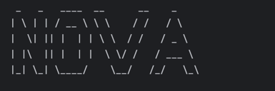
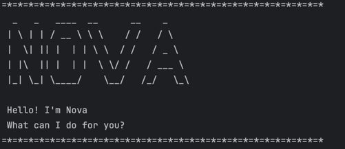

# Nova User Guide



Nova is a simple, interactive **task manager chatbot** that helps you keep track of tasks 
such as Todos, Deadlines, and Events.  
You can add tasks, mark them as done, search, and save them — all through natural text commands.

---
## Quick Start
1. Ensure you have Java `17` or above installed.
2. Download the latest release of Nova.
3. Copy the file to the folder you want to use as the home folder.
4. Open the command terminal, `cd` into the folder you put the jar file in.
5. Run the program with: `java -jar Nova.jar`
6. You should see the Nova welcome message:

7. Type the command in the terminal and press Enter to execute it. rg. typing `help` 
   and pressing Enter will show the list of command that can be used.

<br>

- [Features](#features)
  - [Adding a Todo task: `todo`](#adding-a-todo-task-todo)
  - [Adding a Deadline task: `deadline`](#adding-a-deadline-task-deadline)
  - [Adding a Event task: `event`](#adding-a-event-task-event)
  - [Listing all task: `list`](#listing-all-task-list)
  - [Marking tasks as Done / Not Done: `mark` `unmark`](#marking-tasks-as-done--not-done-mark-unmark)
  - [Deleting a task: `delete`](#deleting-a-task-delete)
  - [Finding tasks by Keyword: `find`](#finding-tasks-by-keyword-find)
  - [Displaying list of commands: `help`](#displaying-list-of-commands-help)
  - [Exiting Nova: `bye`](#exiting-nova-bye)
- [Saving the data](#saving-the-data)
- [Command Summary](#command-summary)

## Features

---
### Adding a Todo task: `todo`
Adds a simple task without date/time.  

**Format**  
`todo DESCRIPTION`  

**Examples**  
- `todo attend lectures`

**Expected Output**  
```
=*=*=*=*=*=*=*=*=*=*=*=*=*=*=*=*=*=*=*=*=*=*=*=*=*=*=*=*=*=*  
 Got it. I've added this task:  
    [T][ ] attend lectures  
 Now you have * tasks in the list.
=*=*=*=*=*=*=*=*=*=*=*=*=*=*=*=*=*=*=*=*=*=*=*=*=*=*=*=*=*=*
```

> **Note:** The `*` in the output will be replaced by the actual number of tasks currently in your list.

<br>

---
### Adding a Deadline task: `deadline`
Add a task that has to be done by a certain date/time.

**Format**  
`deadline DESCRIPTION /by (D)D/(M)M/YYYY HHMM`

**Examples**
- `deadline return book /by 01/01/2025 1800`
- `deadline return book /by 1/1/2025 1800`

**Expected Output**
```
=*=*=*=*=*=*=*=*=*=*=*=*=*=*=*=*=*=*=*=*=*=*=*=*=*=*=*=*=*=*  
 Got it. I've added this task:  
    [D][ ] return book (by: Jan 1 2025 1800)  
 Now you have * tasks in the list.
=*=*=*=*=*=*=*=*=*=*=*=*=*=*=*=*=*=*=*=*=*=*=*=*=*=*=*=*=*=*
```
> **Note:** The `*` in the output will be replaced by the actual number of tasks currently in your list.

<br>

---
### Adding a Event task: `event`
Adds a task that starts and ends within a period of time.

**Format**  
`event DESCRIPTION /from (D)D/(M)M/YYYY HHMM /to (D)D/(M)M/YYYY HHMM`

**Examples**
- `event project meeting /from 06/08/2024 1400 /to 07/08/2024 1800`
- `event project meeting /from 6/8/2024 1400 /to 7/8/2024 1800`

**Expected Output**
```
=*=*=*=*=*=*=*=*=*=*=*=*=*=*=*=*=*=*=*=*=*=*=*=*=*=*=*=*=*=*  
 Got it. I've added this task:  
    [E][ ] project meeting (from: Aug 6 2024 1400 to: Aug 7 2024 1800)
 Now you have * tasks in the list.
=*=*=*=*=*=*=*=*=*=*=*=*=*=*=*=*=*=*=*=*=*=*=*=*=*=*=*=*=*=*
```
> **Note:** The `*` in the output will be replaced by the actual number of tasks currently in your list.

<br>

---
### Listing all task: `list`
Shows the list of tasks in the task list.

**Format**  
`list`

<br>

---
### Marking tasks as Done / Not Done: `mark` `unmark`
Marks/Unmarks a certain task in task list.

| Action   | Format |
|----------|--------|
| ✅ Mark   | `mark INDEX` |
| ❌ Unmark | `unmark INDEX` |


**Examples**
- `mark 1`  
- `unmark 1`

**Expected Output**
```
=*=*=*=*=*=*=*=*=*=*=*=*=*=*=*=*=*=*=*=*=*=*=*=*=*=*=*=*=*=*
 Nice! I've marked this task as done:
    [D][X] return book (by: Jan 1 2000 1900)
=*=*=*=*=*=*=*=*=*=*=*=*=*=*=*=*=*=*=*=*=*=*=*=*=*=*=*=*=*=*
=*=*=*=*=*=*=*=*=*=*=*=*=*=*=*=*=*=*=*=*=*=*=*=*=*=*=*=*=*=*
 OK, I've marked this task as not done yet:
    [D][ ] return book (by: Jan 1 2000 1900)
=*=*=*=*=*=*=*=*=*=*=*=*=*=*=*=*=*=*=*=*=*=*=*=*=*=*=*=*=*=*
```

<br>

---
### Deleting a task: `delete`
Delete a certain task in the task list.

**Format**  
`delete INDEX`

**Example**  
`delete 2`

**Expected Output**
```
=*=*=*=*=*=*=*=*=*=*=*=*=*=*=*=*=*=*=*=*=*=*=*=*=*=*=*=*=*=*
 Got it. I've deleted this task:
   [E][ ] project meeting (from: Aug 6 2024 1400 to: Aug 7 2024 1800)
 Now you have * tasks in the list.
=*=*=*=*=*=*=*=*=*=*=*=*=*=*=*=*=*=*=*=*=*=*=*=*=*=*=*=*=*=*
```
> **Note:** The `*` in the output will be replaced by the actual number of tasks currently in your list.

<br>

---
### Finding tasks by Keyword: `find`
Finds tasks that contains the keyword.

**Format**  
`find KEYWORD`

**Example**  
`find book`

**Expected Output**
```
=*=*=*=*=*=*=*=*=*=*=*=*=*=*=*=*=*=*=*=*=*=*=*=*=*=*=*=*=*=*
 Search: book
 Here are matching tasks in your list:
 1. [T][ ] read book
 2. [D][ ] return book (by: Jan 1 2000 1900)
 3. [T][ ] borrow book
=*=*=*=*=*=*=*=*=*=*=*=*=*=*=*=*=*=*=*=*=*=*=*=*=*=*=*=*=*=*
```

<br>

---
### Displaying list of commands: `help`
Shows all the commands and formats that users can input.

**Format**  
`help`

<br>

---
### Exiting Nova: `bye`
Exit Nova program.

**Format**  
`bye`

<br>

---
### Saving the data
Nova automatically **saves your tasks to a file** 
after every change (adding, marking, unmarking, or deleting).

- The save file is located at: `[JAR file location]/NovaData/Nova.txt`
- The next time you start Nova, it will **load tasks from this file automatically**,
  so you can continue where you left off.

<br>

---
## Command Summary

| Action       | Format                                                                |
|--------------|-----------------------------------------------------------------------|
| **Todo**     | `todo DESCRIPTION`                                                    |
| **Deadline** | `deadline DESCRIPTION /by (D)D/(M)M/YYYY HHMM`                        |
| **Event**    | `event DESCRIPTION /from (D)D/(M)M/YYYY HHMM /to (D)D/(M)M/YYYY HHMM` |
| **List**     | `list`                                                                |
| **Mark**     | `mark INDEX`                                                          |
| **Unmark**   | `unmark INDEX`                                                        |
| **Delete**   | `delete INDEX`                                                        |
| **Find**     | `find KEYWORD`                                                        |
| **help**     | `help`                                                                |
| **Exit**     | `bye`                                                                 |

---
